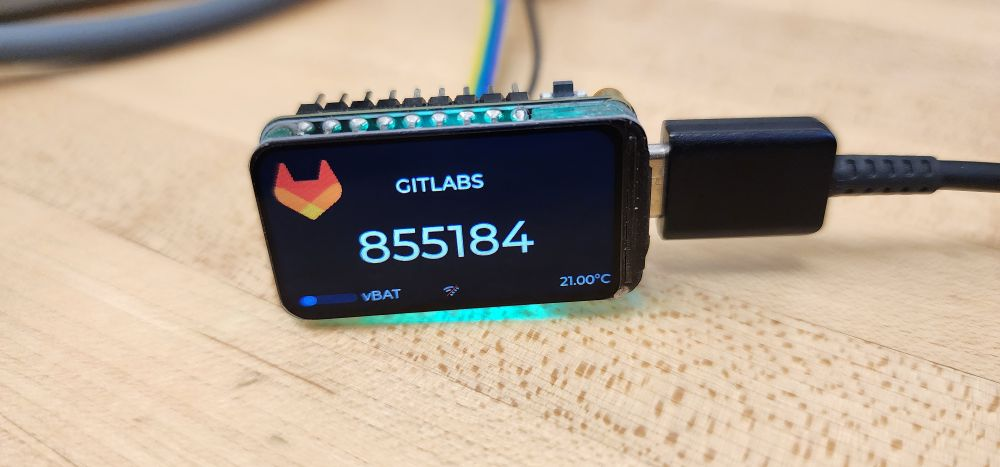
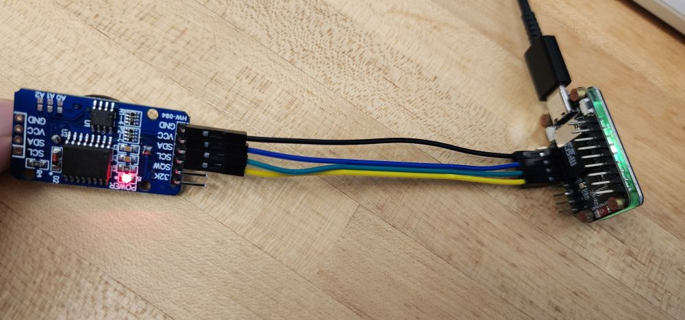
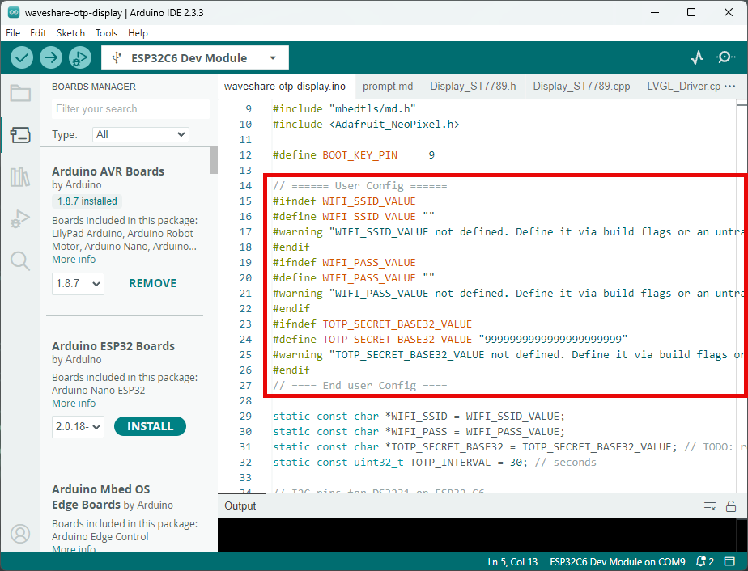
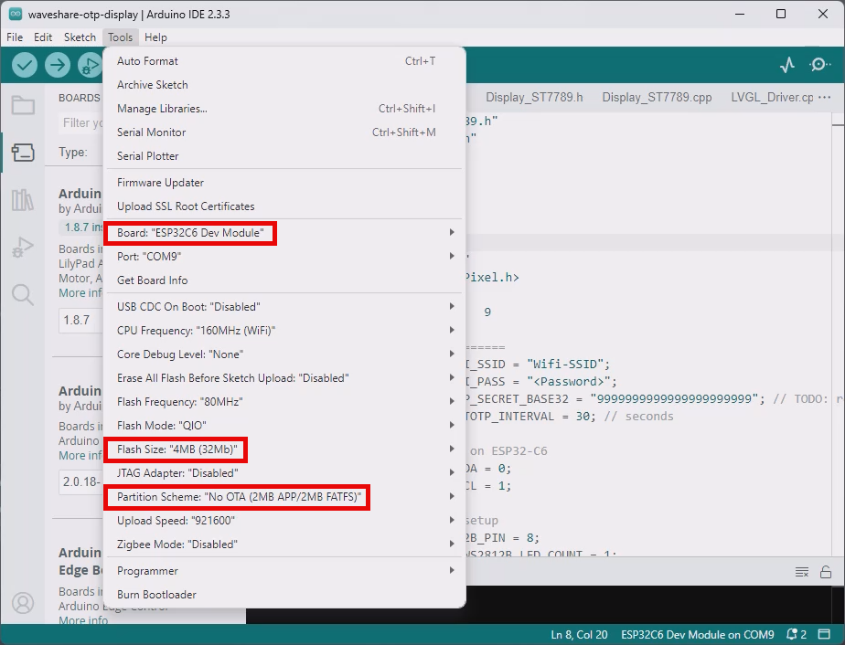

# Waveshare OTP Display (ESP32-C6)

Show a time-based one‑time password (TOTP) and DS3231 temperature on the Waveshare ESP32‑C6 1.47" ST7789 display. If the RTC has lost power, the device connects to Wi‑Fi, syncs time via NTP, and updates the DS3231.



## Features
- TOTP generation (6 digits, 30‑second interval)
- RTC sync from NTP when the DS3231 reports lost power
- Temperature readout from DS3231
- LVGL UI with Wi‑Fi status icons
- Optional WS2812B status LED (rainbow animation)

## Hardware
- [Waveshare ESP32‑C6 1.47" Display Development Board (ST7789, 172×320)](https://www.waveshare.com/wiki/ESP32-C6-LCD-1.47)
  - Includes a WS2812B LED on GPIO 8
- [DS3231 RTC connected via I2C](https://www.aliexpress.us/item/3256805941102171.html)
	- SDA: GPIO 0
	- SCL: GPIO 1

## Wiring
Connect the DS3231 to the ESP32‑C6 module using I2C:

| ESP32‑C6 Module | DS3231 |
|-----------------|--------|
| GND             | GND    |
| 3V3             | VCC    |
| GPIO 0          | SDA    |
| GPIO 1          | SCL    |




## Repository layout
- Arduino sketch: [waveshare-otp-display.ino](waveshare-otp-display.ino)
- Display + LVGL drivers: [Display_ST7789.cpp](Display_ST7789.cpp), [LVGL_Driver.cpp](LVGL_Driver.cpp)
- UI assets generated by SquareLine Studio: [ui.c](ui.c), [ui_Screen1.c](ui_Screen1.c)

## Setup
### 1) Configure credentials and secret
Edit the user config section in [waveshare-otp-display.ino](waveshare-otp-display.ino):

```cpp
static const char *WIFI_SSID = "Wifi-SSID";
static const char *WIFI_PASS = "<Password>";
static const char *TOTP_SECRET_BASE32 = "9999999999999999999999"; // TODO: replace with your secret
static const uint32_t TOTP_INTERVAL = 30; // seconds
```



### 2) Install dependencies
Install the following Arduino libraries:
- ESP32 Arduino core (for ESP32‑C6)
- Adafruit ST7735 and ST7789 Library v1.11.0
- RTClib v2.1.4
- Adafruit NeoPixel v1.15.2
- lvgl v9.3.0

### 3) Build and upload
1. Open [waveshare-otp-display.ino](waveshare-otp-display.ino) in Arduino IDE.
2. Select the ESP32‑C6 board, set partition scheme to `No OTA (2MB App /2MB FATFS)` and set the correct serial port.

3. Upload the sketch.

## Runtime behavior
**Startup**
1. Initialize display and LVGL.
2. If the DS3231 reports lost power, connect to Wi‑Fi and sync time via NTP.
3. Update the RTC and continue offline.

**Main loop (1s)**
- Generate the current TOTP code.
- Read RTC temperature.
- Update the display if values change.

## Notes
- The Wi‑Fi credentials are only used for initial time sync. The device disconnects afterward.
- TOTP secret must be base32‑encoded.

## License
Licensed under the Apache License 2.0. See [LICENSE](LICENSE).
